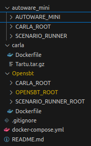

# SimFusion

<p align="center">
  
  <h1 align="center">SimFusion</h1>
  <p align="center"><strong>Multi-Fidelity Simulation-based Testing of Automated Driving Systems</strong></p>
</p>

> **Multi-Fidelity Simulation-based Testing of Automated Driving Systems**

SimFusion is a validation framework for Automated Driving Systems that combines low-fidelity (LoFi) simulation with high-fidelity (HiFi) simulation to efficiently evaluate systems. It uses a trained predictor to orchestrate test execution across simulators of different fidelity levels, reducing overall testing cost while maintaining result quality.

---

## Table of Contents

- [Overview](#overview)
- [Installation](#installation)
  - [Autoware](#autoware)
  - [Frenetix](#frenetix)
- [Replication](#replication)
  - [RQ1 – Agreement/Disagreement Study](#rq1--agreementdisagreement-study)
  - [RQ2 – Effectiveness](#rq2--effectiveness)
  - [RQ3 – Efficiency](#rq3--efficiency)
  - [RQ4 – Diversity](#rq4--diversity)
- [Flakiness Analysis](#flakiness-analysis)
- [Customization](#customization)
- [Supplementary Material](#supplementary-material)

---

## Overview

SimFusion addresses the challenge of balancing **test fidelity** and **computational cost** in simulation-based testing of autonomous driving systems. The key idea is:

1. Use a **trained predictor** to identify when LoFi and HiFi results are likely to agree or disagree.
2. Run tests in LoFi when agreement is likely, and HiFi otherwise.
3. Use an optimizer (Genetic Algorithm) to optimize selection of new tests based on past execution/fitness results.
3. (validation only) Re-run failing lofi tests in the HiFi simulator for validation.

This approach significantly reduces the number of expensive HiFi simulations while preserving the ability to detect critical failures.

---

## Installation

SimFusion supports two case studies: **Autoware** and **Frenetix**. The installation for each setup can take up to 1 hour.

### Autoware

#### Requirements

| Requirement | Version |
|---|---|
| Ubuntu | 22.04 |
| Nvidia Docker Toolkit | Required (for CARLA and Autoware) |

#### Setup

Deployment is done via Docker. The goal is to deploy the HiFi simulator **CARLA**, the LoFi simulator **SimpleSim**, **Autoware Mini**, and **SimFusion**.

**Step 1:** Ensure the following folder structure inside `autoware_mini/`:



> The structure is important, as Docker Compose builds images from within these folders.

Clone Autoware Mini into the `AUTOWARE_MINI` folder from the [Autoware Mini public repo](https://github.com/UT-ADL/autoware_mini). Then:

1. Download [Tartu.tar.gz](https://drive.google.com/file/d/10CHEOjHyiLJgD13g6WwDZ2_AWoLasG2F/view?usp=share_link) and place it inside the `carlar0_9_13/` folder.
2. Download [CARLA 0.9.13](https://carla-releases.s3.eu-west-3.amazonaws.com/Linux/CARLA_0.9.13.tar.gz), extract the `PythonAPI` folder, and place it inside `autoware_mini/CARLA_ROOT/`.
3. Clone the Scenario Runner into `autoware_mini/SCENARIO_RUNNER/`:

```bash
git clone -b route_scenario https://github.com/UT-ADL/scenario_runner.git
```

**Step 2:** Start all containers (LoFi, HiFi, and SimFusion):

```bash
./restart_containers.sh
```

Track deployment status with `docker ps`. Expected output:

```
CONTAINER ID   IMAGE                       COMMAND                  CREATED
c63163bfc1ec   autoware_mini:latest        "bash -c 'source /op…"   5 days ago
14d2f1e84862   prathap/carla_sim:v0.9.13   "bash ./CarlaUE4.sh …"   5 days ago
5c11ff733cce   autoware_mini:latest        "bash -c 'source /op…"   6 days ago
aa4e48ba40d9   opensbt:latest              "bash"                   3 weeks ago
```

> **Note:** `autoware_mini` appears twice — once for LoFi and once for HiFi execution.

**Step 3:** Log into the SimFusion container and run experiments:

```bash
docker exec -it opensbt /bin/bash
```

From within the container, run any experiment script named `run_case_aw_*.py`.

---

### Frenetix

#### Requirements

| Requirement | Version |
|---|---|
| Operating System | Windows 11 |
| BeamNG.tech | 0.32.5 |
| Ubuntu (WSL2) | 22.04.5 LTS |
| Python | 3.10 |
| GifSki | 1.32.0 |
| GNU Make | 4.3 |

#### Setup

1. Clone the [TUM-AVS/MultiDrive](https://github.com/TUM-AVS/MultiDrive) repository.
2. Follow the [BeamNG installation steps](https://github.com/TUM-AVS/MultiDrive/tree/main?tab=readme-ov-file#installation).
3. Complete the [Python environment setup in WSL](https://github.com/TUM-AVS/MultiDrive/tree/main?tab=readme-ov-file#python-setup-in-wsl).

From within WSL, run any experiment script named `run_case_planer_*.py`.

---

## Replication

Instructions for replicating results for the **Autoware** case study. The Frenetix case study follows a similar approach.

### RQ1 – Agreement/Disagreement Study

Generate tests using Random Search (RS) and NSGA-II, then rerun all tests in both LoFi and HiFi.

```bash
# Random Search in HiFi
python -m simulations.carla.test_carla_sim \
    --seed 1 \
    --algo "rs" \
    --population_size 300 \
    --n_generations 1 \
    --sim_rerun "lofi" \
    --n_rerun 1

# NSGA-II in LoFi
python -m simulations.simple_sim.opensbt_start \
    --seed 1 \
    --algo "ga" \
    --population_size 15 \
    --n_generations 20 \
    --sim_rerun "lofi" \
    --n_rerun 1

# NSGA-II in HiFi
python -m simulations.carla.test_carla_sim \
    --seed 1 \
    --algo "ga" \
    --population_size 15 \
    --n_generations 20 \
    --sim_rerun "lofi" \
    --n_rerun 1
```

Evaluate agreement/disagreement rates by training classifier models (update the data path to your generated data first):

```bash
python -m predictor.agreement_predictor_aw
```

### RQ2 – Effectiveness

**Evaluate surrogate models:**

```bash
python -m surrogate_log.test_surrogate_log \
    --sample 3.33045987 8.0211280 17.00739165 \
    --model "RF" "GL" "MLP" \
    --data_folder "./surrogate_log/data/data_predictor/" \
    --apply_smote
```

Options: `--apply_smote` for SMOTE oversampling, `--do_balance` for class balancing. Models: `RF` (Random Forest), `GL` (Generalized Linear), `MLP` (Multi-Layer Perceptron).

**Run all approaches for comparison:**

```bash
# Surrogate-based
python -m simulations.carla.test_carla_sim_surrogate \
    --seed 1 \
    --population_size 20 \
    --rerun_only_critical \
    --model "RF" \
    --data_folder "./surrogate/data/batch6/" \
    --do_balance \
    --wandb_project "XYZ" \
    --maximal_execution_time "03:00:00"

# SimFusion (Multi-Fidelity)
python -m simulations.multi_sim.test_multi_sim_predict \
    --seed 1 \
    --population_size 20 \
    --maximal_execution_time "03:00:00" \
    --n_rerun 1 \
    --only_if_no_hifi \
    --rerun_only_critical \
    --wandb_project "XYZ" \
    --th_certainty 0.8

# HiFi only
python -m simulations.carla.test_carla_sim \
    --seed 1 \
    --population_size 20 \
    --maximal_execution_time "03:00:00" \
    --n_rerun 1 \
    --rerun_only_critical \
    --wandb_project "XYZ" \
    --only_if_no_hifi

# LoFi only
python -m simulations.simple_sim.opensbt_start \
    --seed 1 \
    --population_size 20 \
    --maximal_execution_time "03:00:00" \
    --n_rerun 1 \
    --rerun_only_critical \
    --wandb_project "XYZ" \
    --only_if_no_hifi
```

**Key flags:**
- `--only_if_no_hifi` — Validates LoFi failures in HiFi if not already run.
- `--ratio` — Set a max number of samples (integer) or percentage (float) for rerun.

**Independent LoFi failure validation:**

```bash
python -m resume.resume_validation_lofis \
    --root ./results_wandb \
    --project "lofi-validation" \
    --entity "lofi-hifi" \
    --simulate_function "beamng" \
    --sim_rerun hifi \
    --sim_original lofi \
    --rerun_only_critical \
    --n_rerun 1 \
    --only_if_no_hifi \
    --seeds 17 \
    --ratio 25 \
    --save_folder "<myfolder>" \
    --problem_name "LoFi_GA_pop10_t06_00_00_seed1"
```

### RQ3 – Efficiency

Evaluate the failure rate after completed runs. We recommend using [Weights & Biases (wandb)](https://wandb.ai/) for convenient metric inspection.

```bash
python -m postprocess.run_analysis_aw
```

### RQ4 – Diversity

Evaluate test diversity:

```bash
python -m postprocess.run_analysis_diversity_aw
```

---

## Flakiness Analysis

To evaluate simulator flakiness, use the scripts in the [`flaky/`](https://github.com/ast-fortiss-tum/simfusion/tree/main/Opensbt/OPENSBT_ROOT/flaky) folder.

---

## Customization

To apply SimFusion to your own system and use case:

| Step | Description |
|---|---|
| 1 | Implement a simulator interface for your LoFi and HiFi simulator by subclassing the `Simulator` class. |
| 2 | Define the test input space (parameters and ranges), fitness function, and criticality function. |
| 3 | Align scenario execution between HiFi and LoFi. This is specific to your use case, scenario, and simulator. |
| 4 | Evaluate scenario alignment using the provided distance metric scripts. |
| 5 | Collect agreement/disagreement data using the provided data collection scripts. |
| 6 | Train a predictor to determine the best orchestration model. |
| 7 | Instantiate the `ADASMultiSimPredictCertainProblem` class and start your testing experiments. |

---

## Supplementary Material

🚧 Will be added soon.
