# Supplementary Material

This folder contains supplementary data including failure discovery over time, failure cluster plots, visualization of agreements and disagreements between LoFi and HiFi executions. Further data can be found [here](/supplementary/SimFusion_Supplementary_Material.pdf).

## Failure Discovery

<table>
<tr>
<td align="center"><b>Autoware</b></td>
<td align="center"><b>FrenetiX</b></td>
</tr>
<tr>
<td>
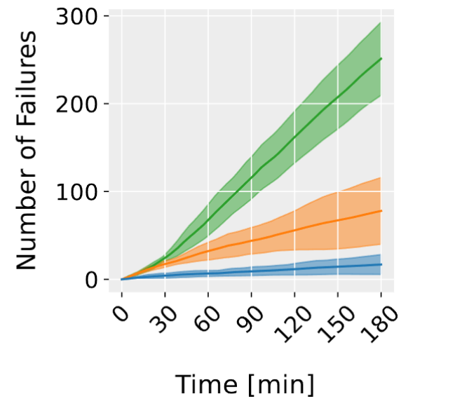
</td>
<td>
  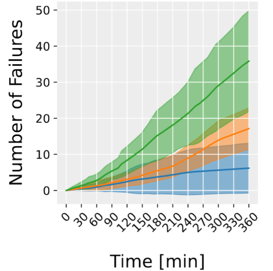
</td>
</tr>
</table>

**Figure 1.** *(Left: Autoware, Right: Frenetix)* Number of failures over time.

- **Green:** SimFusion
- **Orange:** HiFi
- **Blue:** LoFi

---

## Cluster Plots

### Different T-SNE Projection Views

- SimFusion (`triangle`)
- Surrogate (`circle`)
- LoFi (`star`)
- HiFi (`square`)

In particular, SimFusion achieves higher failure cluster coverage nad finds one cluster (top center) which is only covered by its generated test cases.

<table>
<tr>
<td align="center"><b>View 1</b></td>
<td align="center"><b>View 2</b></td>
</tr>
<tr>
<td>
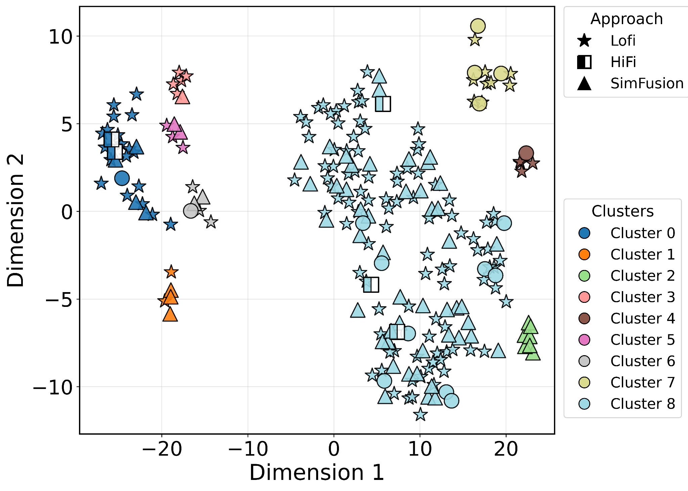
</td>
<td>
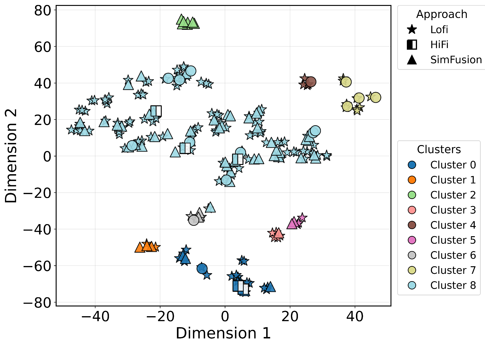
</td>
</tr>
</table>

---

## Visualization Scenarios

# Case Study Autoware

## Disagreement - HiFi Fail, LoFi Pass (DF)

In LoFi, the ego vehicle can stop in front of the pedestrian.
In HiFi, only a short braking maneuver is executed so that a collision occurs.

<table>
<tr>
<td align="center"><b>LoFi</b></td>
<td align="center"><b>HiFi</b></td>
</tr>
<tr>
<td>
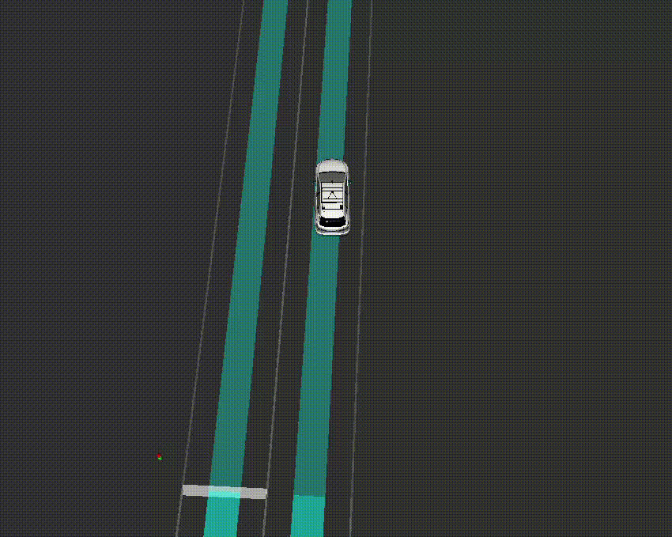</a>
</td>
<td>
</a>
</td>
</tr>
</table>

  <a href="scenarios/PedestrianCrossing_2.53452015_6.18842_13.91333639.xosc">Download Scenario File</a>

---

## Agreement - HiFi Fail, LoFi Fail (AF)

The ego vehicle brakes when approaching the pedestrian but is not able to stop before collision.
A collision occurs in both LoFi and HiFi simulation.

<table>
<tr>
<td align="center"><b>LoFi</b></td>
<td align="center"><b>HiFi</b></td>
</tr>
<tr>
<td>
</a>
</td>
<td>
</a>
</td>
</tr>
</table>

  <a href="scenarios/PedestrianCrossing_1.78592942_4.6553041_11.23898875.xosc">Download Scenario File</a>

---

# Case Study Frenetix  

Ego is represented by id 3001, NPCs by ids 44 and 45.

## Disagreement Fail - HiFi Fail, LoFi Pass (DF)

In BNG, the lane-changing vehicle performs a cut-in maneuver and the ego vehicle gets too close to the vehicle.

<table>
<tr>
<td align="center">
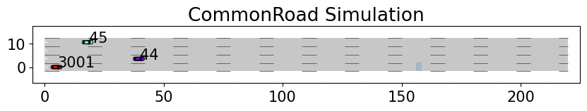
</td>
<td align="center">
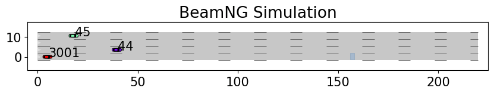
</td>
</tr>
</table>

  <a href="scenarios/PedestrianCrossing_1.78592942_4.6553041_11.23898875.xosc">Download Scenario File</a>

---

## Disagreement Pass - HiFi Pass, LoFi Fail (DP)

In CR, the ego vehicle performs an overtaking maneuver, violating the goal distance.
In BNG, no overtaking occurs and no violation is observed.

<table>
<tr>
<td align="center">
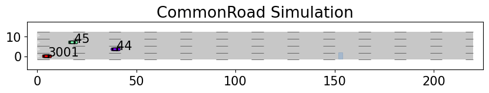
</td>
<td align="center">
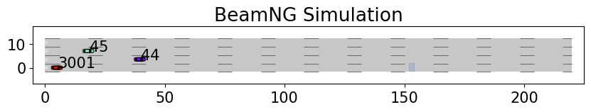
</td>
</tr>
</table>

  <a href="scenarios/PedestrianCrossing_1.78592942_4.6553041_11.23898875.xosc">Download Scenario File</a>

---

## Agreement Fail - HiFi Fail, LoFi Fail (AF)

In BNG, a collision occurs because the ego vehicle brakes and slightly steers to the left.
In CR, the ego vehicle overtakes the blocked vehicle, violating the goal distance.

<table>
<tr>
<td align="center">
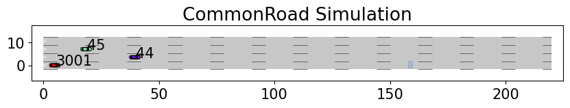
</td>
<td align="center">
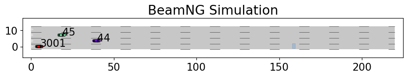
</td>
</tr>
</table>

  <a href="scenarios/PedestrianCrossing_1.78592942_4.6553041_11.23898875.xosc">Download Scenario File</a>

---