# Supplementary Material

This folder contains supplementary data including classifier information, failure discovery over time, failure cluster plots, visualization of agreements and disagreements between LoFi and HiFi executions. Further data can be found [here](https://anonymous.4open.science/r/simfusion-C957/supplementary/SimFusion_Supplementary_Material.pdf).

## Fitness Distribution

The following histograms compare the fitness values recorded by the LoFi and HiFi simulators for the Autoware case study across 591 paired executions. The fitness functions shown are minimum distance and velocity at minimum distance.

<table>
<tr>
<td align="center"><b>Minimum distance</b></td>
<td align="center"><b>Velocity at minimum distance</b></td>
</tr>
<tr>
<td>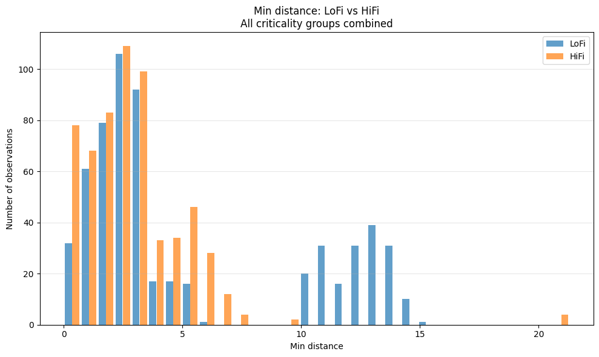</td>
<td>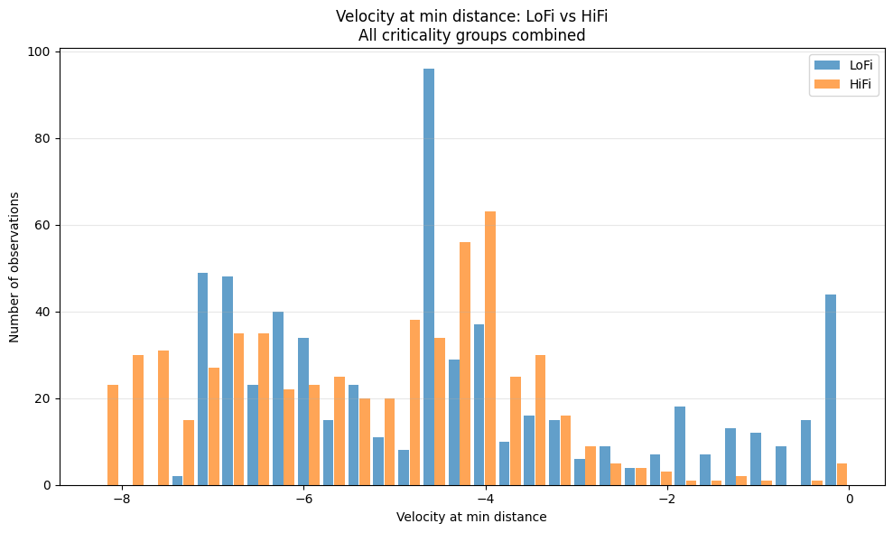</td>
</tr>
</table>

The scatter plots below show the paired fitness differences for minimum distance, calculated as HiFi minus LoFi. Results are shown separately for AF (Agreement Fail) and AP (Agreement Pass).

<table>
<tr>
<td align="center"><b>AF — Agreement Fail</b></td>
<td align="center"><b>AP — Agreement Pass</b></td>
</tr>
<tr>
<td>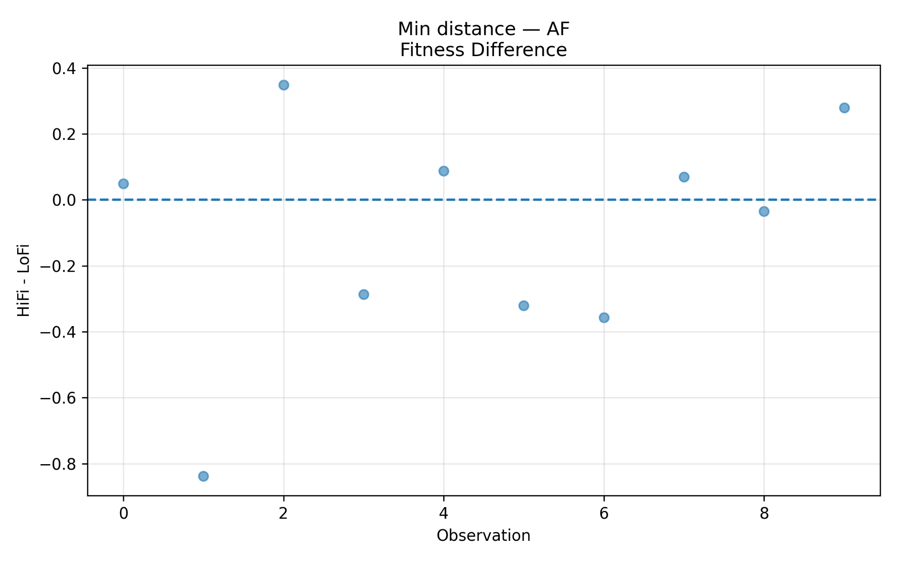</td>
<td>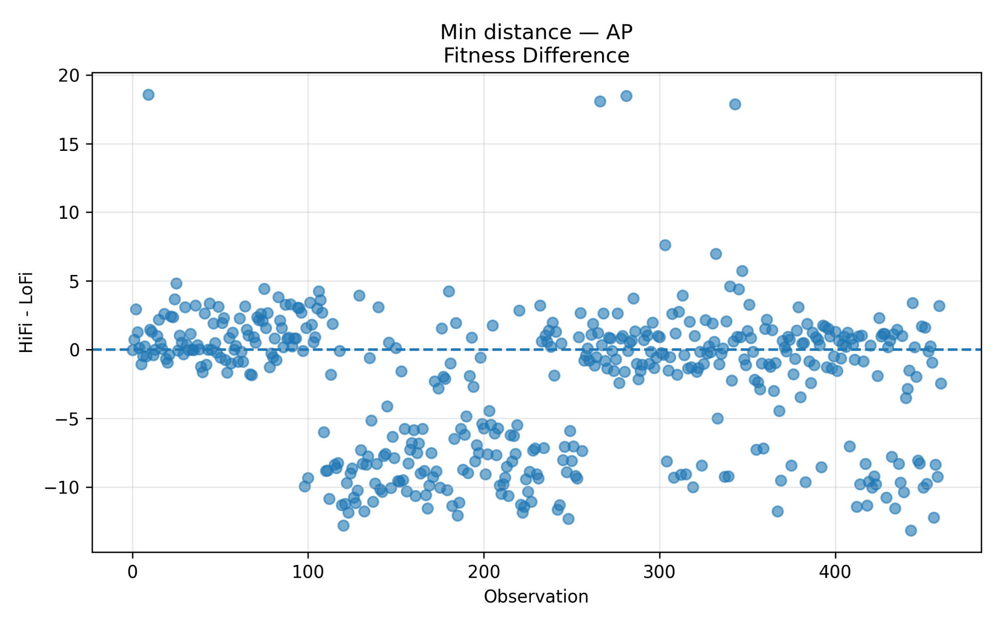</td>
</tr>
</table>

## Classifier Data

Agreement/disagreement classifier training information can be found [here](https://anonymous.4open.science/r/simfusion-C957/Opensbt/OPENSBT_ROOT/predictor/models/cr/best_model_config_rf.json).

## Failure Discovery

<table>
<tr>
<td align="center"><b>Autoware</b></td>
<td align="center"><b>FrenetiX</b></td>
</tr>
<tr>
<td>
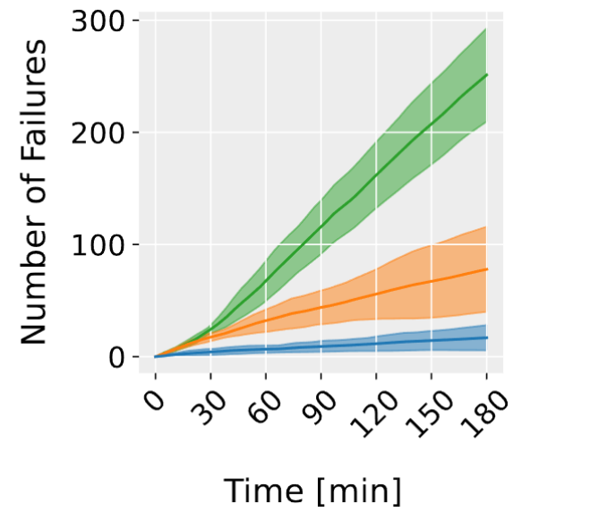
</td>
<td>
  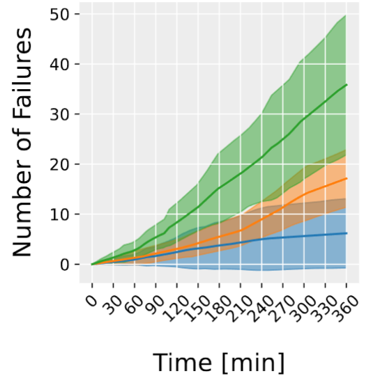
</td>
</tr>
</table>

**Figure 1.** *(Left: Autoware, Right: Frenetix)* Number of failures over time.

- **Green:** SimFusion
- **Orange:** HiFi
- **Blue:** LoFi

---

## Cluster Plots

### Different T-SNE Projection Views

- SimFusion (`triangle`)
- Surrogate (`circle`)
- LoFi (`star`)
- HiFi (`square`)

In particular, SimFusion achieves higher failure cluster coverage nad finds one cluster (top center) which is only covered by its generated test cases.

<table>
<tr>
<td align="center"><b>View 1</b></td>
<td align="center"><b>View 2</b></td>
</tr>
<tr>
<td>
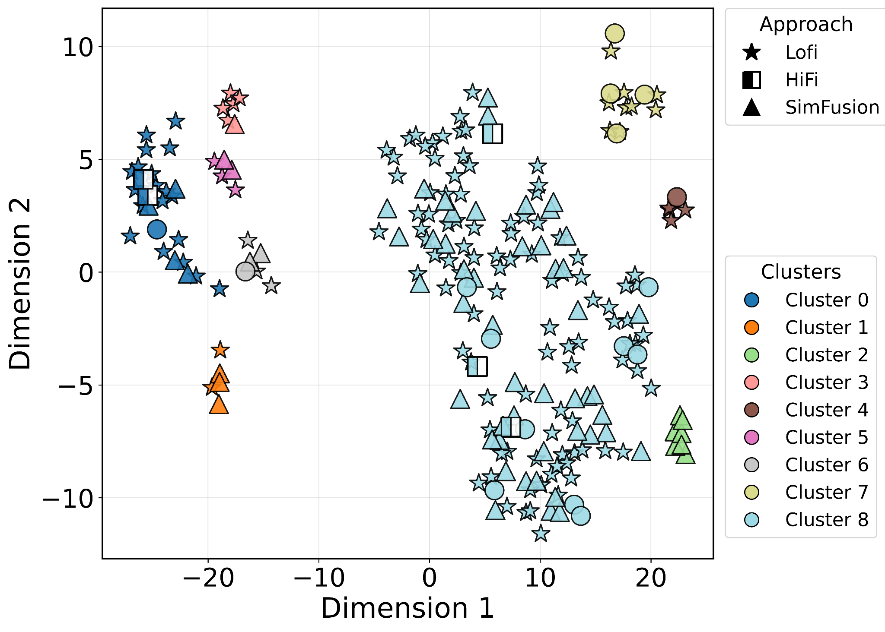
</td>
<td>
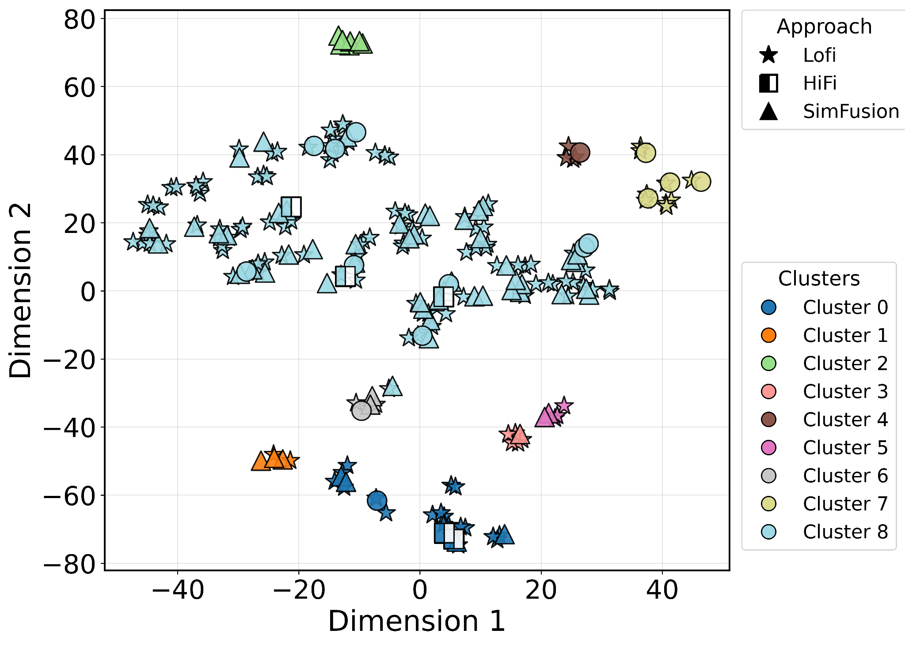
</td>
</tr>
</table>

---

## Visualization Scenarios

# Case Study Autoware

## Disagreement - HiFi Fail, LoFi Pass (DF)

In LoFi, the ego vehicle can stop in front of the pedestrian.
In HiFi, only a short braking maneuver is executed so that a collision occurs.

<table>
<tr>
<td align="center"><b>LoFi</b></td>
<td align="center"><b>HiFi</b></td>
</tr>
<tr>
<td>
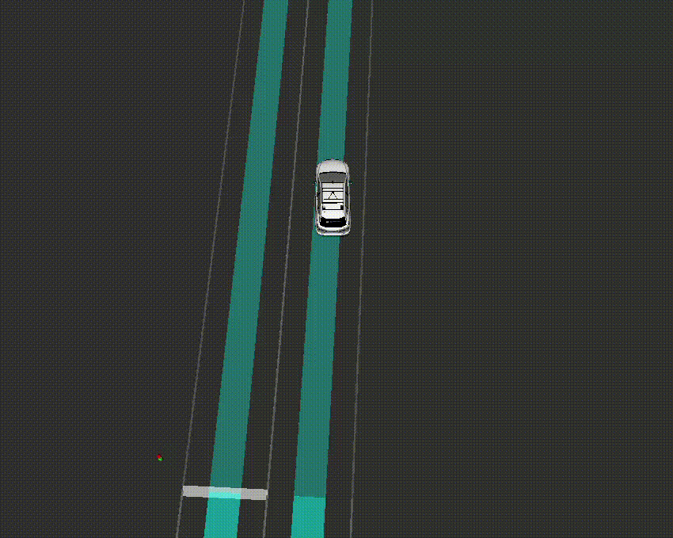</a>
</td>
<td>
</a>
</td>
</tr>
</table>

  <a href="scenarios/PedestrianCrossing_2.53452015_6.18842_13.91333639.xosc">Download Scenario File</a>

---

## Agreement - HiFi Fail, LoFi Fail (AF)

The ego vehicle brakes when approaching the pedestrian but is not able to stop before collision.
A collision occurs in both LoFi and HiFi simulation.

<table>
<tr>
<td align="center"><b>LoFi</b></td>
<td align="center"><b>HiFi</b></td>
</tr>
<tr>
<td>
</a>
</td>
<td>
</a>
</td>
</tr>
</table>

  <a href="scenarios/PedestrianCrossing_1.78592942_4.6553041_11.23898875.xosc">Download Scenario File</a>

---

# Case Study Frenetix  

Ego is represented by id 3001, NPCs by ids 44 and 45.

## Disagreement Fail - HiFi Fail, LoFi Pass (DF)

In BNG, the lane-changing vehicle performs a cut-in maneuver and the ego vehicle gets too close to the vehicle.

<table>
<tr>
<td align="center">
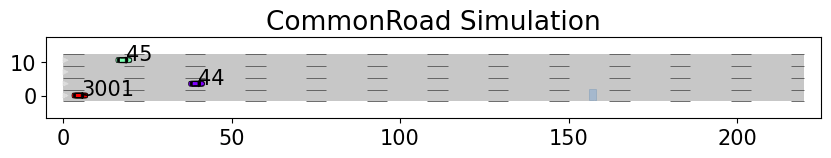
</td>
<td align="center">
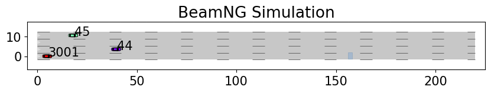
</td>
</tr>
</table>

  <a href="scenarios/Planer_DF_executed.xml">Download Scenario File</a>

---

## Disagreement Pass - HiFi Pass, LoFi Fail (DP)

In CR, the ego vehicle performs an overtaking maneuver, violating the goal distance.
In BNG, no overtaking occurs and no violation is observed.

<table>
<tr>
<td align="center">
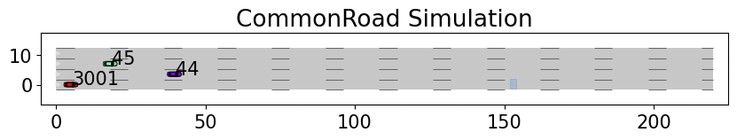
</td>
<td align="center">
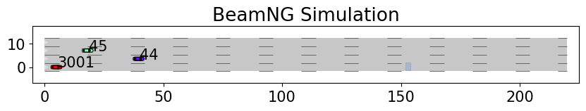
</td>
</tr>
</table>

  <a href="scenarios/Planer_DP_executed.xml">Download Scenario File</a>

---

## Agreement Fail - HiFi Fail, LoFi Fail (AF)

In BNG, a collision occurs because the ego vehicle brakes and slightly steers to the left.
In CR, the ego vehicle overtakes the blocked vehicle, violating the goal distance.

<table>
<tr>
<td align="center">
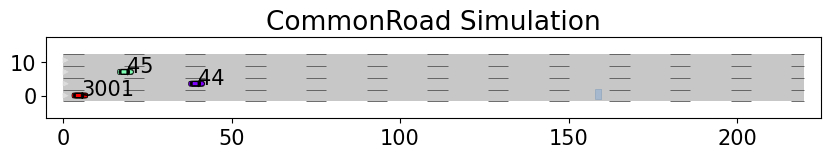
</td>
<td align="center">
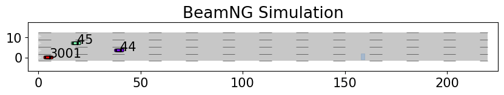
</td>
</tr>
</table>

  <a href="scenarios/Planer_AF_executed.xml">Download Scenario File</a>

---
